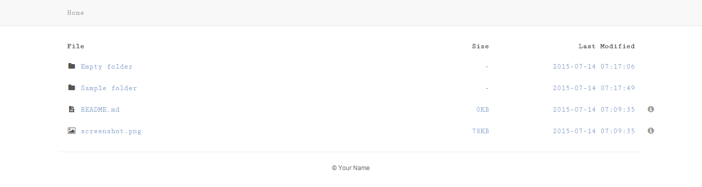

# php-directory-listing

Easy-to-use and minimalist PHP directory listing script with Twiter Bootstrap theme and Font Awesome icons.

## Screenshot

## Installation

The only file and folder you need to get started are `index.html` and `_resources` respectively.

To add a new theme, just create your new theme folder inside `_resources\themes` and then modify `config.php` file in `_resources` to assign it to your theme folder under parameter called `theme_name`.

You may see the `bootstrap\index.php` file as a reference in creating your own theme file.

## License

MIT License
